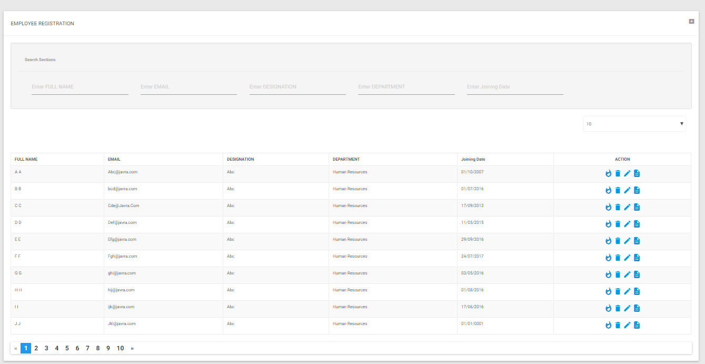

# NjDataGrid
A datagrid for Angular with .NET. Ongoing project


## Frameworks

1. [.NET 10](https://dotnet.microsoft.com/download/dotnet/10.0)

    1. **Repository Patterns and Dependency Injections**
    2. Generics
    3. Actions, Expressions and other delegates
    4. Dynamic Linq

    
2. [Angular 19](https://angular.io)
    1. Custom Datagrid
    2. Dynamic Columns and Action Button
    3. Dynamic Pagination Features
    4. Dynamic Search Box (One from all or separate Columns for each Textbox)


***
## Upgrade Summary

This project has been upgraded from .NET Core 2.1 / Angular 6 to **.NET 10 / Angular 19.2.18**.

### Backend (.NET Core 2.1 → .NET 10)
- All projects retargeted to `net10.0`
- **AutoMapper** upgraded to 12.0.1
- **Entity Framework Core** upgraded to 9.0.3
- **System.Linq.Dynamic.Core** upgraded to 1.6.0 (security patch for GHSA-4cv2-4hjh-77rx)
- `System.Data.SqlClient` replaced with `Microsoft.Data.SqlClient 5.2.2`
- `Program.cs` migrated to modern `Host.CreateDefaultBuilder` pattern
- `Startup.cs` updated: `IHostingEnvironment` → `IWebHostEnvironment`, routing middleware modernised

### Frontend (Angular 6 → Angular 19.2.18)
- **Security:** Angular 19.2.18 patches XSRF token leakage and XSS via unsanitized SVG attributes
- Removed deprecated `@angular/http`; all HTTP calls use `HttpClient`
- Removed `ng6-bootstrap-modal`; dialogs use Angular Material `MatDialog`
- Angular Material imports use specific subpaths (e.g. `@angular/material/dialog`)
- `BrowserAnimationsModule` added (required by Angular Material)
- `angular.json` migrated to the Angular 18+ `application` builder
- All `@Component`/`@Directive`/`@Pipe` decorators include `standalone: false` (Angular 19 default changed to `true`)

### Security fixes
| Vulnerability | Package | Fix |
|---|---|---|
| XSRF token leakage via protocol-relative URLs | `@angular/common` | Upgrade to 19.2.18 |
| XSS via unsanitized SVG script attributes | `@angular/compiler`, `@angular/core` | Upgrade to 19.2.18 |
| Stored XSS via SVG animation/MathML attributes | `@angular/compiler` | Upgrade to 19.2.18 |
| Property reflection RCE | `System.Linq.Dynamic.Core` | Upgrade to 1.6.0 |

***
## Codes
> In this project, other than generic function, there are some codes, written just to show implementation of certain features in C#. There may be better ways to do. But we wrote it to show some of C# advance features. You will not need this to implement datagrid in your project.
```csharp
     Func<string, string, string> FullName = 
                    delegate(string firstName, string lastName)
                  {
                      return firstName + " " + lastName;

                  };
     result.Items.ToList().ForEach(p => p.FullName = FullName(p.FirstName, p.LastName));
```
***

***
## Steps
Open Command prompt and go to project folder, ```NjGrid```
> (*Make sure that npm and .NET 10 SDK are installed*).
* > Inside NjGrid Folder. In command prompt type ```dotnet restore```
* > Inside ClientApp folder inside NjGrid folder, type in command prompt ```npm install```  
* > Again from NjGrid Folder, Type in command prompt, ```dotnet build```
* > Type ```dotnet run``` or ```dotnet watch run``` as per your choice or requirements

***
## Sample Image


> 


***

## Our saying
   > Though We have tried to implement easy to understand and readable as well as generic functions without compromising with the best coding practise along with standard and efficient codes, there may be sections and areas needed to improve.
   
   You are most welcome to suggest change. 


